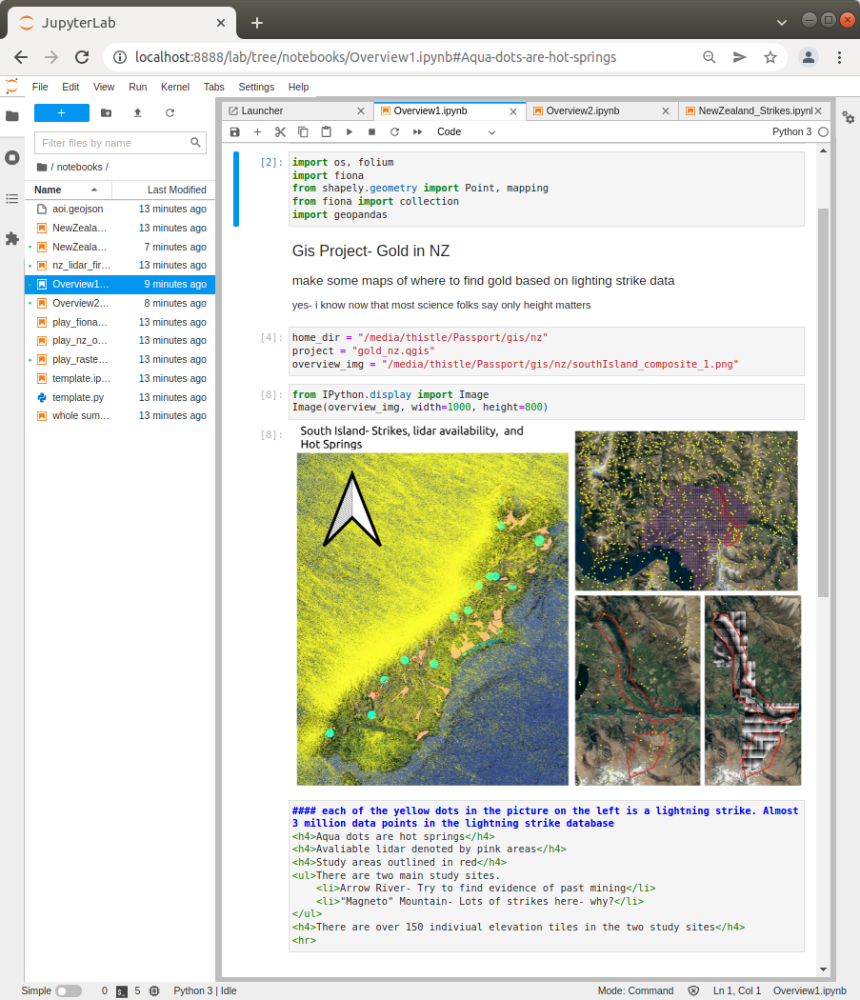
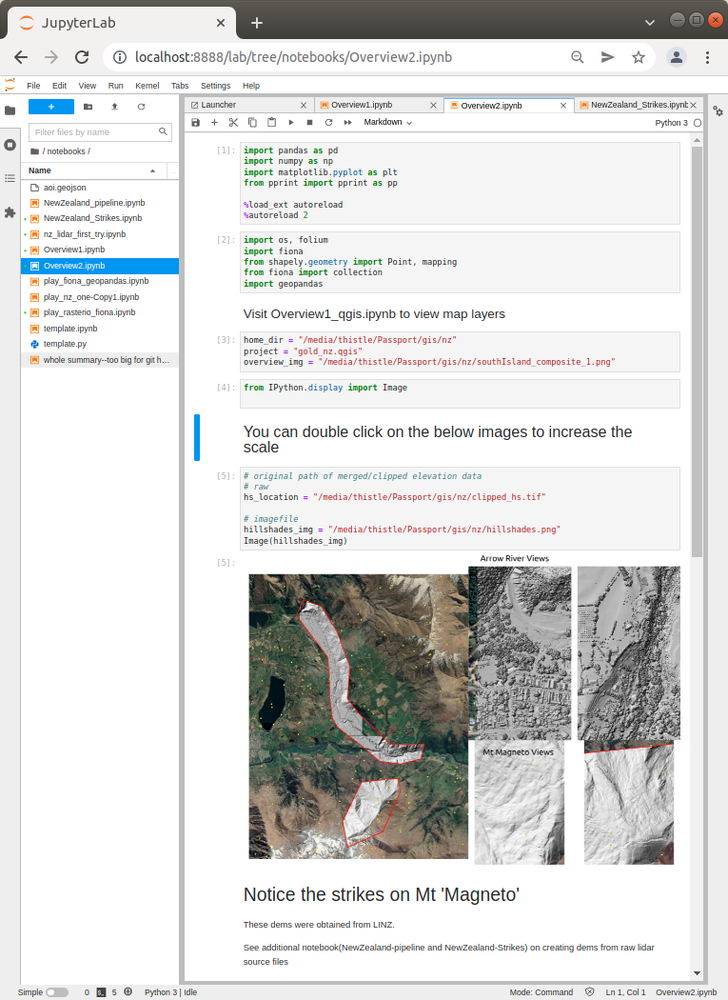

<h3>Finding Gold by assessing Lightning Strike Anomilies in New Zealand</h3>

<h4>Using point cloud data to analyze lightning strike anomilies locations.
</h4>

<h3>South Island Overview</h3>

<h4>Sites, strikes, and elevation tiles used for dem creation
</h4>

<h3>DEM Pipelint</h3>
<img src="pdal_pipeline.png"

This project has been set up using PyScaffold 3.2.3. For details and usage
information on PyScaffold see https://pyscaffold.org/.
